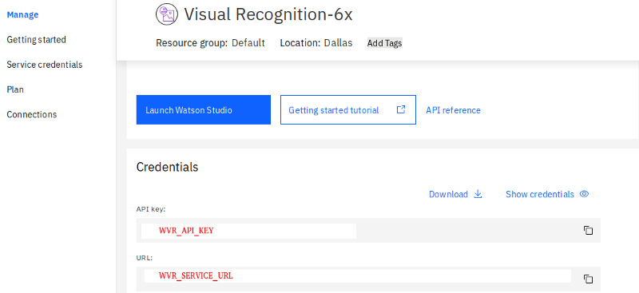
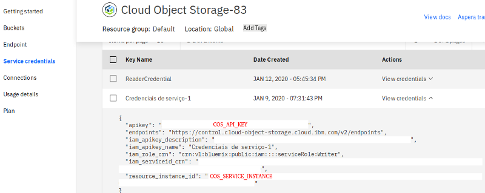

# Knowledge Deployment

Knowledge Deployment is a pipeline that automatically deploys an image
recognition model by downloading the images of the classes and uploading them to
Watson Visual Recognition. This repository contains the Knowledge Deployment 
implementation. If you want to implement it, read the README files on the folders.

## Resources

Knowledge Deployment was developed using Watson Visual Recognition, Cloud Object
Storage and Cloud Functions of IBM Cloud.

Watson Visual Recognition is the image classification service of IBM. It will be
used on Knowledge Deployment to create customized image classification models.

Cloud Object Storage is the IBM service equivalent to Amazon's Simple Storage
Service (S3), which is used to store files. In Knowledge Deployment, Cloud Object
Storage is used to store the images that will be sent to Watson Visual Recognition
for training.

Lastly, Cloud Functions implements serverless functions, executing the code just
when necessary. It makes possible to use computing resources just when needed, not
requiring a server to be always running, like happens when Pivotal Cloud Foundry
or OpenShift is used. Besides this fact, Cloud Functions also allows the creation
of APIs to call the implemented functions.


## Before starting

1. Have an IBM Cloud account;
2. Create the services Watson Visual Recognition, Cloud Object Storage and Cloud
Functions;
3. Have Python ≥ 3.6 installed on your computer (if you want to test the scripts);
4. Install [ibmcloud-cli](https://cloud.ibm.com/docs/cli?topic=cloud-cli-install-ibmcloud-cli#ibmcloud-cli-installer)
and [Docker](https://docs.docker.com/install/) to create actions with packages
not available on Cloud Functions;
5. Obtain the following secrets from Watson Visual Recognition and Cloud Object Storage:





## Configuring Knowledge Deployment

1. Go to the subfolders and execute the actions on their README files;
2. Create an API on Cloud Functions called *knowledgeDelivery* and add a POST
route named */deploy* with the action created on *deploy* folder and GET routes
named */classify* and */available_classifiers*, with the actions created inside
*classify* and *available_classifiers* folders, respectively;
3. Now Knowledge Deployment may be done and you can test it, using POST with JSON content
```{"classifier": "NAME_CLASSIFIER", "keywords": [ARRAY_WITH_THE_CLASSES]}``` on the
*/deploy* route for automatic deployment of a model, */available_classifiers* to
retrieve the list of available classifiers and */classify* to classify a base64
image.